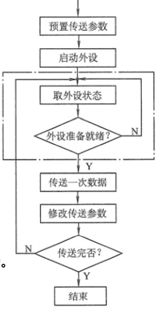

课时1概述

课时2定点数的表示和运算

# 第三章 存储系统

## 3.1 存储器概述

## 1、存储器的分类

### 一、按在计算机中的作用（层次）分类

1）**主存储器**。简称**主存**，又称内存储器（内存），用来存放计算机运行期间所需的大量程序和数据，CPU可以直接随机地对其进行访问，也可以和高速缓冲存储器（Cache）及辅助存储器交换数据。其特点是容量较小、存取速度较快、单位价格较高。

2）**辅助存储器**。简称**辅存**，又称外存储器（外存），是主存储器的后援存储器，用来存放当前暂时不用的程序和数据，以及一些需要永久性保存的信息，它不能与CPU直接交换信息。其特点是容量极大、存取速度较慢、单位成本低。

3）**高速缓冲存储器**。简称**Cache**，位于主存和CPU之间，用来存放正在执行的程序段和数据，以便CPU能高速地使用它们。Cache的存取速度可与CPU的速度相匹配，但存储容量小、价格高。目前的高档计算机通常将它们制作在CPU中。

### 二、按存储介质分类

按存储介质，存储器可分为磁表面存储器（磁盘、磁带）、磁心存储器半导体存储器（MOS型存储器、双极型存储器）和光存储器（光盘）。

### 三、按存取方式分类

1）**随机存储器（RAM）**。存储器的任何一个存储单元的内容都可以随机存取，而且存取时间与存储单元的物理位置无关。其优点是读写方便、使用灵活，主要用作主存或高速缓冲存储器。RAM又分为静态RAM
（以触发器原理寄存信息）和动态RAM （以电容充电原理寄存信息）。

2）**只读存储器（ROM）**。存储器的内容只能随机读出而不能写入。信息一旦写入存储器就固定不变，即使断电，内容也不会丢失。

### 四、按信息的可保存性分类

断电后、存储信息即消失的存储器，称为**易失性存储器**，如RAM。
断电后、存储信息仍然保持的存储器，称为**非易失性存储器**，如ROM、磁表面存储器和光存储器。
若某个存储单元所存储的信息被读出时，原存储信息被破坏，则称为**破坏性读出**；若读出时，被读单元原存储信息不被破坏，则称为**非破坏性读出**。
具有破坏性读出性能的存储器，每次读出操作后，必须紧接一个再生的操作，以便恢复被破坏的信息。

## 2、存储器的性能指标

存储器有3个主要性能指标，即**存储容量、单位成本和存储速度**。这3个指标相互制约，设计存储器系统所追求的目标就是大容量、低成本和高速度。

一、**存储容量**=存储字数x字长（如1Mx8位）。单位换算:1B （Byte，字节）=8b （bit，位）。存储字数表示存储器的地址空间大小，字长表示一次存取操作的数据量。

二、**单位成本** ：每位价格=总成本/总容量。

三、**存储速度** ：数据传输率=数据的宽度/存储周期。

（1）**存取时间**（T）︰存取时间是指从启动一次存储器操作到完成该操作所经历的时间，分为读出时间和写入时间。
（2）**存取周期**（T）︰存取周期又称读写周期或访问周期。它是指存储器进行一次完整的读写操作所需的全部时间，即连续两次独立访问存储器操作（读或写操作）之间所需的最小时间间隔。
（3）**主存带宽**（B）∶主存带宽又称数据传输率，表示每秒从主存进出信息的最大数量，单位为字/秒、字节/秒（B/ s）或位/秒（b / s） .

**存取时间不等于存储周期**，通常存储周期大于存取时间。这是因为对任何一种存储器，在读写操作之后，总要有一段恢复内部状态的复原时间。
对于破坏性读出的存储器，存取周期往往比存取时间大得多，甚至可达Tm= 2T，因为存储器中的信息读出后需要马上进行再生。

课时4指令系统（1）

课时5中央处理器（1）

# 课时6 输入输出系统（1）

## 6.1 I/O系统基本概念

### 1、输入/输出系统

- 输入/输出是以主机为中心而言的，将信息从外部设备传送到主机称为输入，反之称为输出。
- 输入/输出系统解决的主要问题是对各种形式的信息进行输入和输出的控制

>  I/O系统中的几个基本概念如下：

1）**外部设备**。包括输入/输出设备及通过输入/输出接口才能访问的外存储设备。

2）**接口**。在各个外设与主机之间传输数据时进行各种协调工作的逻辑部件。协调
包括传输过程中速度的匹配、电平和格式转换等。

3）**输入设备**。用于向计算机系统输入命令和文本、数据等信息的部件。键盘和
鼠标是最基本的输入设备。

4）**输出设备**。用于将计算机系统中的信息输出到计算机外部进行显示、交换等
的部件。显示器和打印机是最基本的输出设备。

5）**外存设备**。指除计算机内存及CPU缓存等外的存储器。硬磁盘、光盘等是最基
本的外存设备。

- 一般来说，**I/O系统**由I/O软件和I/O硬件两部分构成：

1）**I/O软件**。包括驱动程序、用户程序、管理程序、升级补丁等。通常采用I/O
指令和通道指令实现CPU与I/O设备的信息交换。
2）**I/O硬件**。包括外部设备、设备控制器和接口、I/O总线等。通过设备控制器
来控制I/O设备的具体动作；通过I/O接口与主机（总线）相连。

### 2、I/O控制方式

- 在输入/输出系统中，经常需要进行大量的数据传输，而传输过程中有各种不同的I/O控制方式，基本的控制方式主要有以下4种：

1）**程序查询方式**。由CPU通过程序不断查询I/O设备是否已做好准备，从而控制I/O设备与主机交换信息。

2）**程序中断方式**。只在I/O设备准备就绪并向CPU发出中断请求时才予以响应。

3）**DMA方式**。主存和I/O设备之间有一条直接数据通路，当主存和 I/O设备交换信息时，无须调用中断服务程序。

4）**通道方式**。在系统中设有通道控制部件，每个通道都挂接若干外设，主机在执行I/O命令时，只需启动有关通道，通道将执行通道程序，从而完I/O操作。

**注：** 方式1）和方式2）主要用于数据传输率较低的外部设备，方式3）和方式4）主
要用于数据传输率较高的设备。

## 6.2 I/O方式

- 输入/输出系统实现主机与I /O设备之间的数据传送，可以采用不同的控制方式，各种方式在代价、性能、解决问题的着重点等方面各不相同，常用的I/O方式有**程序查询**、**程序中断**、**DMA和通道**等，其中前两种方式更依赖于CPU中程序指令的执行。

### 1、程序查询方式

- 信息交换的控制完全由**主机执行程序**实现，程序查询方式接口中设置一个数据缓冲寄存器（数据端口）和一个设备状态寄存器（状态端口）。主机进行I /o操作时，先发出询问信号，读取设备的状态并根据设备状态决定下一步操作究竟是进行数据传送还是等待。

>  程序查询方式的工作流程如下：

- ①CPU执行初始化程序，并预置传送参数。
- ②向I / o接口发出命令字，启动I/o设备。
- ③从外设接口读取其状态信息。
- ④CPU不断查询I /o设备状态，直到外设准备就绪。
- ⑤传送一次数据。
- ⑥修改地址和计数器参数。
- ⑦判断传送是否结束，若未结束转第③步，直到计数器为0。

- 在这种控制方式下，CPU一旦启动I/O，就必须停止现行程序的运行，并在现行程序插入一段程序。
- 程序查询方式的**主要特点**是**CPU有“踏步”等待现象，CPU与l/O串行工作**。这种方式的接口设计简单、设备量少，但CPU在信息传送过程中要花费很多时间来查询和等待，而且在一段时间内只能和一台外设交换信息，效率大大降低。

### 2、程序中断方式

- **中断 **是现代计算机有效合理地发挥效能和提高效率的一个十分重要的功能。CPU中通常设有处理中断的机构-中断系统，以解决各种中断的共性问题。

	

#### 中断的基本概念

​		程序中断是指在计算机执行现行程序的过程中，出现某些急需处理的异常情况或特殊请求，CPU暂时中止现行程序，而转去对这些异常情况或特殊请求进行处理，在处理完毕后CPU又自动返回到现行程序的断点处，继续执行原程序。

**程序中断的作用：**

- ①实现CPU与I /O设备的并行工作。

- ②处理硬件故障和软件错误。

- ③实现人机交互，用户干预机器需要用到中断系统。

- ④实现多道程序、分时操作，多道程序的切换需借助于中断系统。

- ⑤实时处理需要借助中断系统来实现快速响应。

- ⑥实现应用程序和操作系统（管态程序）的切换，称为“软中断”。

- ⑦多处理器系统中各处理器之间的信息交流和任务切换。

**程序中断方式的思想：**

- CPU在程序中安排好于某个时刻启动某台外设，然后CPU继续执行原来的程序，不需要像查询方式那样一直等待外设准备就绪。一旦外设完成数据传送的准备工作，就主动向CPU发出中断请求，请求CPU为自己服务。在可以响应中断的条件下，CPU暂时中止正在执行的程序，转去执行中断服务程序为外设服务，在中断服务程序中完成一次主机与外设之间的数据传送，传送完成后，CPU返回原来的程序，如图。

