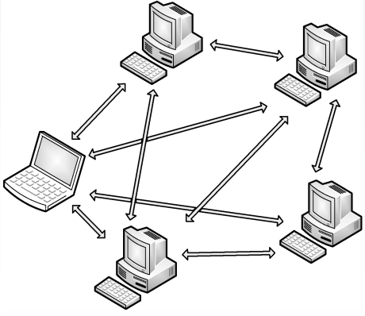

第一章、概述

第二章、物理层

第三章、数据链路层

第四章、网络层

第五章、传输层

# 第六章、应用层

## 6.1 网络应用模型

### 客户/服务器模型

​		**客户/服务器**(Client/Server，C/S）模型中，有一个总是打开的主机称为服务器，它服务于许多来自其他称为客户机的主机请求。其工作流程如下:

- 服务器处于接收请求的状态

- 客户机发出服务请求，并等待接收结果

- 服务器收到请求后，分析请求，进行必要的处理,得到结果并发送给客户

**客户/服务器模型最主要的特征是∶客户是服务请求方，服务器是服务提供。**

### P2P模型

​		C/S模型中服务器性能的好坏决定了整个系统的性能，当大量用户请求服务时，服务器就必然成为系统的瓶颈。

​		P2P模型的思想是整个网络中的传输内容不再被保存在中心服务器上，**每个结点都同时具有下载、上传的功能**，其权利和义务都是大体对等的。

## 6.2域名系统(DNS)

### 层次域名空间

​		因特网采用**层次树状结构的命名方法**。采用这种命名方法，任何一个连接到因特网的主机或路由器，都有一个唯一的层次结构名称，即**域名**。域是名字空间中一个可被管理的划分。

**根**

**顶级域名**

- 国家顶级域名cn,us,uk

- 通用顶级域名com,net,org,gov,int,aero,museum,travel基础结构域名/反向域名arpa

**二级域名**

- 类别域名ac,com,edu,gov,mil,net,org
- 行政区域名用于我国各省、自治区、直辖市bj,js

**三级域名**

**四级域名**

关于域名中的标号有以下几点需要注意:

- 标号中的英文不区分大小写
- 标号中除连字符(-)外不能使用其他的标点符号
- 每个标号不超过63个字符，多标号组成的完整域名最长不超过255个字符
- 级别最低的域名写在最左边，级别最高的顶级域名写在最右边

### 域名服务器

​		因特网的域名系统被设计成一个**联机分布式**的数据库系统，并采用客户/服务器模型。域名到IP地址的解析是由运行在域名服务器上的程序完成的。

主要有4种类型的域名服务器：

1. 根域名服务器

2. 顶级域名服务器

3. 权域名服务器(权限域名服务器)

4. 本地域名服务器

### 域名解析过程

​		域名解析是指**把域名映射成为IP地址**或**把IP地址映射成域名**的过程。前者称为**正向解析**，后者称为**反向解析**。当客户端需要域名解析时，通过本机的DNS客户端构造一个DNS请求报文，以**UDP数据报**方式发往本地域名服务器

​		域名解析有两种方式：**递归查询**和**递归与迭代**相结合的查询

## 6.3文件传输协议FTP

### FTP的工作原理

​		**文件传输协议（File Transfer Protocol）**是因特网上使用得最广泛的文件传输协议。FTP提供**交互式**的访问，允许客户指明文件的类型与格式，并允许文件具有存取权限
​		FTP采用客户/服务器的工作方式，它使用**TCP**可靠的传输服务。一个FTP服务器进程可同时为多个客户进程提供服务。FTP的服务器进程由两大部分组成：一个**主进程**，负责接收新的请求；另外有**若干从属进程**，负责处理单个请求。

其工作步骤如下

- 开熟知端口21(控制端口)，使客户进程能够连接
- 等待客户进程发连接请求
- 启动从属进程来处理客户进程发来的请求。主进程与从属进程并发执行，从属进程对客户进程的请求处理完毕后即终止
- 回到等待状态，继续接收其他客户进程的请求

#### 控制连接与数据连接

FTP在工作时使用两个并行的TCP连接：一个是**控制连接**（端口号21)，一个是**数据连接**（端口号20)

- 控制连接：控制连接用来传输控制信息(如连接请求、传送请求等)，在整个会话期间**一直保持打开**状态（21端口)

- 数据连接：有两种传输模式，**主动模式传送数据**是“服务器”"连接到“客户端”的端口；**被动模式传送数据**是"客户端”连接到“服务器”的端口(20端口)

## 6.4电子邮件

### 电子邮件系统的组成结构

​		一个电子邮件系统应具有三个最主要的组成构件，即**用户代理**、**邮件服务器**和**电子邮件使用的协议**。

- **用户代理(UA)：** 用户与电子邮件系统的接口。用户代理向用户提供一个很友好的接口来发送和接收邮件，用户代理至少应当具有撰写、显示和邮件处理的功能
- **邮件服务器：** 它的功能是发送和接收邮件，同时还要向发信人报告邮件传送的情况（已交付、被拒绝、丢失等)。邮件服务器采用客户/服务器方式工作，但它必须能够同时充当客户和服务器

- **邮件发送协议和读取协议︰** 邮件发送协议用于用户代理向邮件服务器发送邮件或在邮件服务器之间发送邮件，如SMTP；邮件读取协议用于用户代理从邮件服务器读取邮件，如POP3

**SMTP用的是“推”(Push)的通信方式，POP3用的是“拉”(Pull)的通信方式**

### 电子邮件格式与MIME

**电子邮件格式**

**多用途网际邮件扩充(MIME)**

​		由于SMTP只能传送一定长度的ASCII码，许多其他非英语国家的文字（如中文、俄文，甚至带重音符号的法文或德文）就无法传送，且无法传送可执行文件及其他二进制对象，因此提出了用途网络邮件扩充。

### SMTP和POP3

**SMTP**

SMTP用的是 **TCP连接，端口号为25**。SMTP通信有以下三个阶段

- 连接建立：发件人的邮件发送到发送方邮件服务器的邮件缓存中后，SMTP客户就每隔一定时间对邮件缓存扫描一次。如发现有邮件，建立TCP连接
- 邮件传送:连接建立后，就可开始传送邮件。邮件的传送从MAIL命令开始，MAIL命令后面有发件人的地址
- 连接释放:邮件发送完毕后，SMTP客户应发送QUIT命令。SMTP服务器返回的信息是221(服务关闭)，表示SMTP同意释放TCP连接

### POP3和IMAP

POP也使用客户/服务器的工作方式，在传输层使用TCP，端口号为110。POP有两种工作方式:
"下载并保留"和"下载并删除"

## 6.5万维网(www)

### WWW的概念与组成结构

**万维网**（World Wide Web，WWW）是一个分布式、联机式的信息存储空间,在这个空间中：一样有用的事物称为一样“资源”，并由一个全域“**统一资源定位符**”(URL)标识。这些资源通过超文本传输协议(HTTP)传送给使用者，而后者通过单击链接来获取资源

万维网的内核部分是由三个标准构成的:

- **统—资源定位符(URL)** 。负责标识万维网上的各种文档，并使每个文档在整个万维网的范围内具有唯一的标识符URL
- **超文本传输协议(HTTP)** 。一个应用层协议，它使用TCP连接进行可靠的传输，HTTP是万维网客户程序和服务器程序之间交互所必须严格遵守的协议
- **超文本标记语言(HTML)** 。一种文档结构的标记语言，它使用一些约定的标记对页面上的各种信息（包括文字、声音、图像、视频等)、格式进行描述

工作流程:
	Web用户使用浏览器（(指定URL)与Web服务器建立连接，并发送浏览请求; Web服务器把URL转换为文件路径，并返回信息给Web浏览器;通信完成，关闭连接

### 超文本传输协议(HTTP)

**HTTP的操作过程**
用户单击鼠标后所发生的事件按顺序如下

- 浏览器分析链接指向页面的URL

- 浏览器向DNS请求解析IP地址

- 域名系统DNS解析出该网站服务器的IP地址

- 浏览器与该服务器建立TCP连接浏览器发出HTTP请求

- 服务器通过HTTP响应把文件发送给浏览器释放TCP连接

- 浏览器解释文件，并将Web页显示给用户

**HTTP的特点**

HTTP使用TCP作为运输层协议，保证了数据的可靠传输。HTTP不必考虑数据在传输过程中被丢弃后又怎样被重传

HTTP是无状态的。也就是说，同一个客户第二次访问同一个服务器上的页面时，服务器的响应与第一次被访问时的相同

HTTP既可以使用**非持久连接**，也可以使用**持久连接**

- 对于非持久连接，每个网页元素对象（(如JPEG图形、Flash等)的传输都需要单独建立一个TCP连接
- 持久连接，是指万维网服务器在发送响应后仍然保持这条连接，使同一个客户（浏览器）和该服务器可以继续在这条连接上传送后续的HTTP请求和响应报文

常见应用层协议小结

