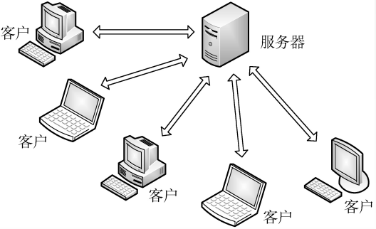

第一章、概述

第二章、物理层

第三章、数据链路层

第四章、网络层

第五章、传输层

# 第六章、应用层

## 6.1 网络应用模型

### 客户/服务器模型

​		**客户/服务器**(Client/Server，C/S）模型中，有一个总是打开的主机称为服务器，它服务于许多来自其他称为客户机的主机请求。其工作流程如下:

- 服务器处于接收请求的状态

- 客户机发出服务请求，并等待接收结果

- 服务器收到请求后，分析请求，进行必要的处理,得到结果并发送给客户

**客户/服务器模型最主要的特征是∶客户是服务请求方，服务器是服务提供。**

### P2P模型

​		C/S模型中服务器性能的好坏决定了整个系统的性能，当大量用户请求服务时，服务器就必然成为系统的瓶颈。

​		P2P模型的思想是整个网络中的传输内容不再被保存在中心服务器上，**每个结点都同时具有下载、上传的功能**，其权利和义务都是大体对等的。

